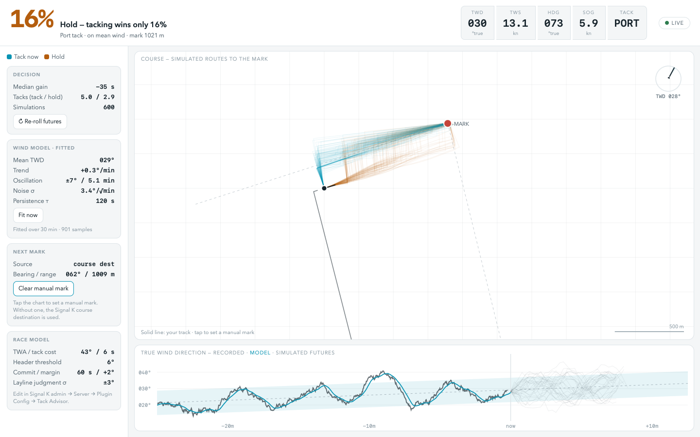

# tack-now

**Tack now, or hold?** A Signal K plugin + webapp that answers the oldest question on the beat with a Monte Carlo simulation: it fits a wind model to the breeze you've actually been sailing in, then races hundreds of paired futures to the next mark — one boat tacking now, one holding — and tells you what fraction of futures the tack wins.



## What it does

- **Buffers your true wind and GPS track** on the server (up to 3 h, sampled every 2 s).
- **Fits a wind model from recorded data**: mean direction, persistent trend (linear fit), oscillation amplitude and period (residual zero-crossings), and short-term noise — refreshed continuously, visible in the side panel.
- **Resolves the next mark** from the Signal K course destination (`navigation.courseGreatCircle.nextPoint`), or a manual mark you set by tapping the chart (persisted server-side). With neither, it assumes a mark 850 m dead upwind so the advice still works.
- **Simulates paired duels**: each Monte Carlo draw generates one wind future (oscillation phase conditioned on the current reading, so "we're 8° right in ±8° swings" means near the top of the cycle); two identical boats sail it — one tacks immediately, one holds — then both follow the same rules: tack when headed past a threshold, tack on the layline (called on expected wind, with a margin and a per-race judgment error), pay a tack cost, and crack off to the mark once they can lay it.
- **The headline number** is the percentage of futures where tacking now reaches the mark first.

## Install

Install `tack-now` from the Signal K app store, or:

```bash
cd ~/.signalk
npm install tack-now
```

Enable it in **Server → Plugin Config → Tack Now**, then open **Webapps → Tack Now**.

### Data the plugin needs

| Path | Use |
|---|---|
| `environment.wind.directionTrue` (falls back to `directionGround`, then heading + `angleTrueGround` / `angleTrueWater`) | the wind model — enable the *derived-data* plugin's Ground Wind calc if you only have apparent wind |
| `navigation.position` | boat position and track |
| `navigation.headingTrue` (or COG) | current tack detection |
| `navigation.speedOverGround` | live boat speed (optional) |
| `navigation.courseGreatCircle.nextPoint` | next mark (optional — or tap the chart) |

## Settings

All wind-model and racing-model parameters live in the plugin config (they're deliberately not on the main screen):

- **Wind fit window** — how much history the model is fitted to (default 30 min).
- **Boat** — tacking angle (TWA), tack cost in seconds, upwind speed, whether to use live SOG.
- **Racing model** — header threshold, post-tack commitment, layline margin (+ = overstand insurance), layline judgment error σ (spreads the fleet into over- and under-standers).
- **Wind override** — pin oscillation amplitude/period, trend, noise, and shift persistence instead of using the fitted values.

## Develop / demo

No boat required:

```bash
npm run dev        # → http://localhost:3300 with a synthetic beat
```

The mock server (`dev/mock-server.js`) simulates an oscillating breeze and a boat beating to a mark, and serves the same REST API as the plugin. Opening `public/index.html` with no server at all drops the webapp into a self-contained demo mode.

`tack_now.html` is the original standalone model playground — every parameter on sliders, no Signal K needed. Useful for building intuition about the model.

## Model notes (and honest limitations)

- Wind: `TWD(t) = mean + trend·t + amp·sin(2πt/period + φ) + OU(τ, σ)`, φ conditioned on the current reading (rising/falling branch ambiguity + jitter).
- The two duel boats share each wind future *and* each layline judgment error — the question is the decision, not the crew.
- Uniform wind across the course (no puffs or geography), flat water, no current, no other boats, fixed boat speed while beating, instant crack-off when the mark is layable.
- Upwind legs only, for now.

## REST API

| Route | Method | Purpose |
|---|---|---|
| `/plugins/tack-now/state` | GET | live values, resolved mark, settings |
| `/plugins/tack-now/history` | GET | buffered wind + track |
| `/plugins/tack-now/mark` | PUT | set manual mark `{latitude, longitude}` |
| `/plugins/tack-now/mark` | DELETE | clear manual mark |

## License

MIT
